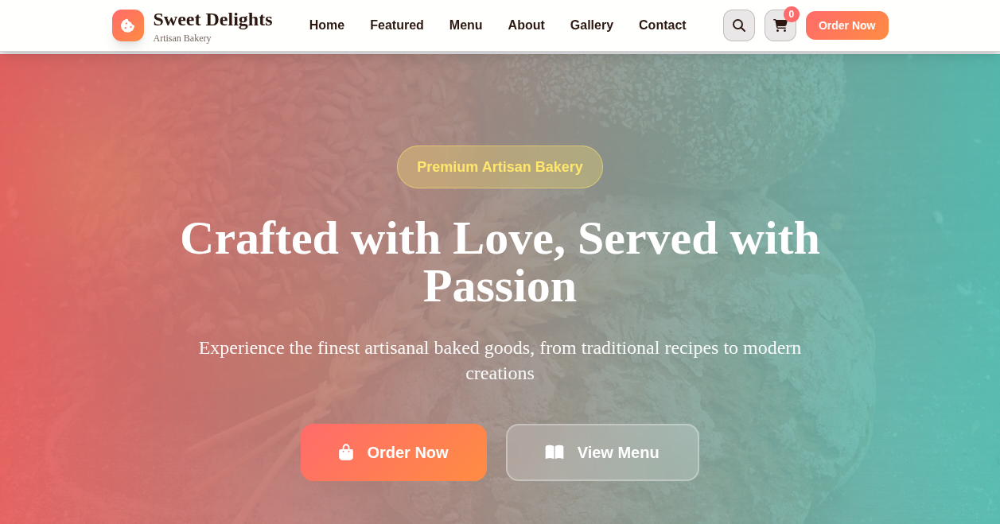

# 🍰 Sweet Delights Bakery

A modern, responsive bakery website built with HTML, CSS, and JavaScript. Featuring a beautiful UI with smooth animations and interactive elements.

## 🌟 Live Demo



Live Demo: https://bakery-demo-web.vercel.app

## ✨ Features

- 🎨 Modern and responsive design
- 🍪 Interactive menu with categories
- 🛒 Shopping cart functionality
- 📱 Mobile-friendly interface
- ⚡ Fast loading performance
- 🌈 Beautiful animations and transitions

## 🛠️ Technologies Used

- **Frontend:**
  - HTML5
  - CSS3 (with Tailwind CSS)
  - JavaScript (ES6+)
  - Font Awesome Icons

- **Deployment:**
  - GitHub Pages

## 🚀 Getting Started

1. **Clone the repository:**
   ```bash
   git clone [https://github.com/mohakamran/bakery.git](https://github.com/mohakamran/bakery.git)
   cd bakery
